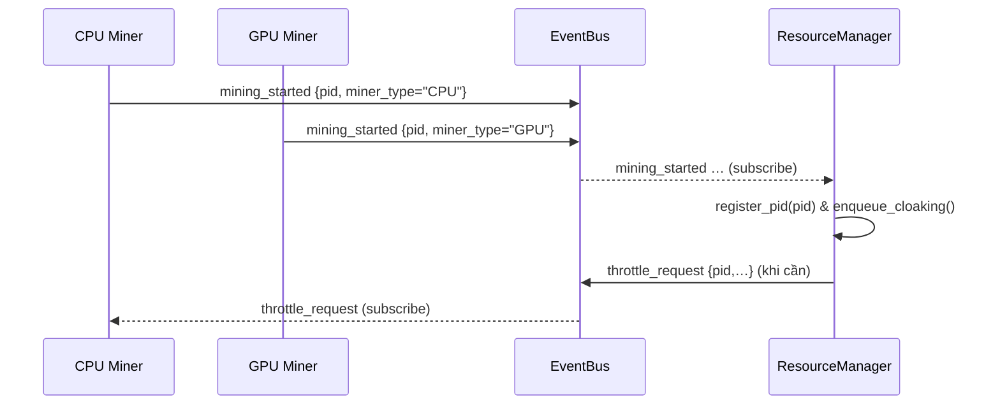

# Tích Hợp EventBus Cho Hệ Thống Mining

## 1️⃣ Mục tiêu tích hợp EventBus
Giúp **ResourceManager** phát hiện và quản lý tiến trình mining **không phụ thuộc** vào tên tiến trình.

Mục tiêu chi tiết:
1. **Real-time discovery** (phát hiện thời gian thực).
2. **Loose Coupling** (tách rời lỏng lẻo).
3. **Observability** (khả năng quan sát qua sự kiện).
4. **Scalability** (mở rộng dễ dàng khi thêm miner mới).

## 2️⃣ Giải pháp tổng thể
### 2.1 Luồng hoạt động

### 2.2 Vai trò & kênh sự kiện
| Thành phần | Publish | Subscribe |
|------------|---------|-----------|
| CPU Core Worker | mining_started, mining_error, hashrate_update | throttle_request, stop_request |
| GPU Miner | mining_started, gpu_temp_update, mining_error | throttle_request, stop_request |
| ResourceManager | throttle_request, restore_request | mining_* |

*Channel đề xuất*: `cpu_mining`, `gpu_mining`, `control` (sử dụng **topic-based routing**).

### 2.3 Công nghệ gợi ý
* **pyee** – PoC in-process.
* **Redis Pub/Sub** – prod đơn máy.
* **RabbitMQ** / **Kafka** – đa máy, thông lượng lớn.

## 3️⃣ Các phase triển khai
| Phase | Công việc | Kết quả |
|-------|-----------|---------|
| **1 – Foundation** | Tích hợp thư viện EventBus (`event_bus.py`), định nghĩa schema JSON. | EventBus hoạt động. |
| **2 – Miner Integration** | CPU/GPU miner publish `mining_started` & `mining_error`. | Miner phát sự kiện. |
| **3 – ResourceManager Hook** | Subscriber nhận `mining_started` ➜ `register_pid`. Giảm polling. | RM nhận PID chính xác. |
| **4 – Control & Monitoring** | RM phát `throttle_request`; miner lắng nghe. Dashboard stream events. | Vòng điều khiển hoàn chỉnh. |
| **5 – Test & Rollout** | Unit/integration test ➜ canary rollout. | Hệ thống ổn định. |

## 4️⃣ Lợi ích & rủi ro
### 4.1 Ưu điểm
* Không phụ thuộc tên tiến trình.
* Phản ứng nhanh.
* Kiến trúc mở rộng & dễ bảo trì.

### 4.2 Rủi ro & Giảm thiểu
| Rủi ro | Mitigation |
|--------|------------|
| Message loss | Redis Stream/Rabbit durable queue + ACK |
| Late subscriber | Retention window 5 s hoặc miner replay định kỳ |
| Complexity | Bắt đầu với pyee ➜ nâng cấp Redis khi ổn |
| SPOF (Redis) | Redis cluster + health-check fallback direct call |

## 5️⃣ Thay đổi logic sau khi áp dụng EventBus
* **discover_mining_processes**: giảm hoặc bỏ polling; giữ fallback mỗi 10 s.
* **enqueue_cloaking** & **CloakStrategy**: giữ nguyên.
* **Bổ sung** sự kiện phản hồi (`cloaking_applied`, `cloaking_health`) để tăng observability.

---
© 2025 Architectural Design – Mining Platform 