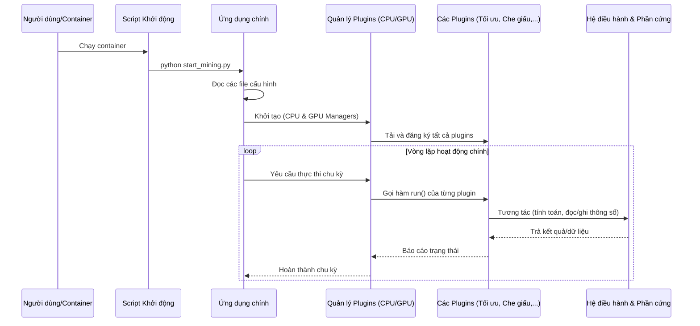

# Phân tích hoạt động của chương trình từ codebase

Chào bạn, dựa trên toàn bộ cấu trúc và các tệp tin trong codebase, tôi sẽ phân tích chi tiết hoạt động của chương trình theo yêu cầu của bạn.

---

### **Tổng quan về hệ thống**

Đây là một hệ thống phần mềm phức tạp, được thiết kế cho mục đích thực hiện các tác vụ tính toán hiệu năng cao trên cả CPU và GPU. Dựa vào các thuật ngữ như `mining` (khai thác), `optimization` (tối ưu hóa), `cloaking` (che giấu), và `randomx` (một thuật toán Proof-of-Work), có thể khẳng định đây là một **hệ thống khai thác tiền điện tử** hoặc một ứng dụng tương tự đòi hỏi hiệu suất tối đa và khả năng hoạt động một cách kín đáo, tránh bị các hệ thống giám sát phát hiện.

---

### 1. ️ Cấu trúc tổng thể

#### **1.1. Sơ đồ cây thư mục cốt lõi**

Cấu trúc dự án được tổ chức một cách module hóa, tập trung toàn bộ logic nghiệp vụ vào thư mục `app/`.

```
/home/azureuser/grok4/
└───app/
    ├───start_mining.py             # <-- Điểm vào (Entry Point) chính của ứng dụng
    ├───requirements.txt            # <-- Các thư viện Python phụ thuộc
    ├───Dockerfile                  # <-- Cấu hình để đóng gói ứng dụng vào container
    ├───entrypoint.sh               # <-- Script khởi chạy ứng dụng trong container
    ├───mining_environment/         # <-- Module cốt lõi chứa toàn bộ logic
    │   ├───config/                 # <-- Thư mục chứa các file cấu hình
    │   │   ├───ml_inference_config.py
    │   │   ├───system_params.json
    │   │   └───...
    │   ├───cpu_plugins/            # <-- Module quản lý các plugin cho CPU
    │   │   ├───core/               # <-- Lõi của hệ thống plugin (đăng ký, quản lý)
    │   │   ├───optimization/       # <-- Các plugin tối ưu hóa hiệu năng CPU
    │   │   ├───cloaking/           # <-- Các plugin che giấu hoạt động của CPU
    │   │   └───monitoring/         # <-- Các plugin giám sát CPU
    │   ├───gpu_plugins/            # <-- Module quản lý các plugin cho GPU
    │   │   ├───core/
    │   │   ├───cloaking/           # <-- Các plugin che giấu hoạt động của GPU (rất tinh vi)
    │   │   ├───ebpf/               # <-- Mã eBPF để can thiệp sâu vào hệ thống (kernel-level)
    │   │   └───...
    │   ├───logging/                # <-- Các module cấu hình và quản lý log
    │   └───scripts/                # <-- Các script tiện ích và quản lý tài nguyên
    └───docs/                       # <-- Tài liệu phân tích, thiết kế
```

#### **1.2. Các module chính**

-   **`app/start_mining.py`**: File thực thi chính, là điểm khởi đầu của toàn bộ ứng dụng.
-   **`app/mining_environment/`**: Thư mục chứa "bộ não" của hệ thống.
-   **`app/mining_environment/config/`**: Quản lý tất cả các cấu hình tĩnh và động, từ thông số hệ thống, tối ưu hóa phần cứng đến các giới hạn môi trường.
-   **`app/mining_environment/cpu_plugins/`**: Chịu trách nhiệm về mọi hoạt động liên quan đến CPU, được thiết kế theo kiến trúc plugin linh hoạt.
-   **`app/mining_environment/gpu_plugins/`**: Tương tự như `cpu_plugins` nhưng dành cho GPU, với các kỹ thuật can thiệp sâu và phức tạp hơn.
-   **`app/mining_environment/scripts/`**: Các kịch bản hỗ trợ việc quản lý tài nguyên, thiết lập môi trường và các tác vụ phụ trợ.

#### **1.3. Sơ đồ phân lớp kiến trúc**

Hệ thống có thể được hình dung qua các lớp kiến trúc sau:

```
+------------------------------------------------------+
| Lớp 1: Khởi tạo & Điểm vào (Initialization & Entry)   |
|       (entrypoint.sh, start_mining.py)               |
+------------------------------------------------------+
                  |
                  V
+------------------------------------------------------+
| Lớp 2: Điều phối & Quản lý (Orchestration & Mgmt)    |
|       (cpu_plugins/core, gpu_plugins/core/manager)   |
+------------------------------------------------------+
                  |
                  V
+------------------------------------------------------+
| Lớp 3: Logic nghiệp vụ (Business Logic - Plugins)    |
|  [Tối ưu hóa] [Tính toán] [Che giấu] [Giám sát]       |
|  (cpu_plugins/*, gpu_plugins/*)                      |
+------------------------------------------------------+
                  |
                  V
+------------------------------------------------------+
| Lớp 4: Tương tác Hệ thống & Phần cứng (System/HW)    |
|       (psutil, py-cpuinfo, NVML, eBPF, C libs)       |
+------------------------------------------------------+
```

#### **1.4. Mối quan hệ giữa các thành phần**

-   `entrypoint.sh` gọi `start_mining.py` để bắt đầu.
-   `start_mining.py` tải các file cấu hình từ `config/`, sau đó khởi tạo các **Managers** từ `cpu_plugins/core` và `gpu_plugins/core`.
-   Các **Managers** này sẽ tự động tìm, đăng ký và tải các **Plugins** từ các thư mục con như `optimization/`, `cloaking/`.
-   Các **Plugins** thực thi logic nghiệp vụ chính (tính toán, che giấu) và sử dụng các thư viện ở lớp dưới để tương tác với phần cứng (ví dụ: đọc nhiệt độ CPU, can thiệp vào thư viện đồ họa NVIDIA).

---

### 2. ⚙️ Vai trò thành phần

#### **2.1. Module khởi tạo và điểm vào**

-   **`app/entrypoint.sh`**: Một shell script đơn giản, vai trò duy nhất là thực thi file Python chính `start_mining.py`. Đây là điểm vào tiêu chuẩn cho các ứng dụng được đóng gói trong Docker.
-   **`app/start_mining.py`**:
    -   **Vai trò**: Khởi tạo toàn bộ môi trường hoạt động.
    -   **Trách nhiệm**:
        -   Đọc và phân tích các file cấu hình (`.json`, `.py`).
        -   Thiết lập hệ thống ghi log tập trung.
        -   Khởi tạo các đối tượng quản lý plugin cho CPU và GPU.
        -   Bắt đầu vòng lặp (loop) chính của chương trình, điều phối hoạt động của các plugin.

#### **2.2. Module xử lý logic nghiệp vụ chính**

Đây là phần cốt lõi, được chia thành hai nhánh CPU và GPU, cả hai đều theo **kiến trúc plugin**.

-   **`cpu_plugins/` và `gpu_plugins/`**:
    -   **Vai trò**: Thực thi các tác vụ chuyên biệt trên CPU và GPU.
    -   **`core/` (registry.py, manager.py)**: "Trái tim" của hệ thống plugin. Nó tự động quét các thư mục con, tìm các file plugin hợp lệ, đăng ký và quản lý vòng đời của chúng. Điều này giúp hệ thống cực kỳ linh hoạt, dễ dàng thêm/bớt chức năng mà không cần sửa code lõi.
    -   **`optimization/`**: Chứa các plugin để tối ưu hóa hiệu suất.
        -   `randomx_optimizer.py`: Tinh chỉnh các thông số cho thuật toán RandomX để đạt hiệu suất cao nhất trên CPU cụ thể.
    -   **`cloaking/` (Che giấu)**: Đây là module đặc biệt và tinh vi nhất.
        -   `stealth_plugin.py` (CPU): Có thể thực hiện các kỹ thuật như thay đổi tên tiến trình, tạo ra các hoạt động giả để "làm nhiễu" các công cụ giám sát hệ thống.
        -   `nvml_interceptor.py` (GPU): Plugin này không chỉ đọc thông tin GPU mà còn **can thiệp (intercept)** vào các cuộc gọi tới thư viện quản lý của NVIDIA (NVML). Nó có thể báo cáo sai thông tin về nhiệt độ, mức sử dụng, tốc độ quạt để đánh lừa các công cụ giám sát rằng GPU đang không hoạt động nặng.
    -   **`monitoring/`**:
        -   `watchdog.py`, `health_probe.py`: Giám sát "sức khỏe" của chính các tiến trình khai thác. Nếu có sự cố, chúng có thể tự động khởi động lại hoặc gửi cảnh báo.

#### **2.3. Thành phần tương tác với hệ thống bên ngoài**

-   **`cloaking_lib/` và `ebpf/`**:
    -   **Vai trò**: Can thiệp sâu vào hệ điều hành và driver phần cứng.
    -   **`cloak.c`, `libcloak.so`**: Mã nguồn C được biên dịch thành thư viện `.so`. Python sẽ gọi các hàm trong thư viện này để thực hiện các tác vụ yêu cầu hiệu năng cao hoặc quyền truy cập cấp thấp mà Python không làm trực tiếp được.
    -   **`ebpf/`**: Chứa mã eBPF (extended Berkeley Packet Filter). Đây là một công nghệ cho phép chạy mã tùy chỉnh trong không gian kernel của Linux một cách an toàn. Hệ thống này có thể dùng eBPF để theo dõi hoặc thay đổi hành vi của các cuộc gọi hệ thống (syscalls), cung cấp một lớp che giấu cực kỳ mạnh mẽ và khó bị phát hiện.

---

### 3.  Luồng hoạt động

#### **3.1. Sơ đồ luồng thực thi chính**



#### **3.2. Mô tả chi tiết luồng hoạt động**

1.  **Khởi động**: Khi container Docker được khởi chạy, `entrypoint.sh` sẽ được thực thi, và nó ngay lập tức gọi `python app/start_mining.py`.
2.  **Khởi tạo**:
    -   `start_mining.py` đọc tất cả các file cấu hình từ `app/mining_environment/config/` để lấy các thông số như loại CPU/GPU, giới hạn tài nguyên, chiến lược tối ưu hóa.
    -   Nó khởi tạo `CPUPluginManager` và `GPUPluginManager`.
    -   Mỗi manager sẽ quét các thư mục con của nó (ví dụ `cpu_plugins/optimization`, `cpu_plugins/cloaking`), tìm các lớp plugin, và nạp chúng vào một danh sách (registry).
3.  **Vòng lặp chính**:
    -   Chương trình bước vào một vòng lặp vô tận (`while True`).
    -   Trong mỗi vòng lặp, nó sẽ yêu cầu các manager thực thi các plugin đã đăng ký.
    -   **Hoạt động song song**: Rất có thể các tác vụ cho CPU và GPU được chạy trên các luồng (threads) hoặc tiến trình (processes) riêng biệt để tận dụng tối đa phần cứng. File `threading_config.json` là một minh chứng cho việc này. Việc quản lý luồng được thực hiện bởi các manager.
4.  **Thực thi Plugin**:
    -   **Tối ưu hóa**: Các plugin tối ưu hóa chạy trước để cấu hình hệ thống.
    -   **Tính toán**: Plugin nghiệp vụ chính (ví dụ: thực hiện tính toán cho thuật toán RandomX) được chạy.
    -   **Che giấu**: Song song với quá trình tính toán, các plugin che giấu liên tục hoạt động. Ví dụ, `nvml_interceptor` sẽ chặn các yêu cầu đọc thông tin GPU và trả về dữ liệu giả.
    -   **Giám sát**: Các plugin giám sát kiểm tra trạng thái của tiến trình. Nếu phát hiện tiến trình chính bị "treo" hoặc bị tắt, watchdog có thể khởi động lại nó.
5.  **Xử lý lỗi**: Hệ thống có các cơ chế `try...except` và ghi log chi tiết. Khi có lỗi, nó sẽ được ghi lại trong `app/mining_environment/logs/` và tùy theo cấu hình, có thể thử lại hoặc khởi động lại thành phần bị lỗi.

---

### 4.  Các cơ chế đặc biệt

-   **Kiến trúc Plugin linh hoạt**: Đây là nền tảng của hệ thống, cho phép dễ dàng mở rộng. Bất kỳ ai cũng có thể viết một plugin mới (ví dụ: một kỹ thuật che giấu mới) và thả vào thư mục tương ứng, hệ thống sẽ tự động nhận diện và chạy nó.
-   **Cơ chế Che giấu (Cloaking) đa lớp**:
    -   **Cấp ứng dụng (Application-level)**: Thay đổi tên tiến trình, làm xáo trộn dấu hiệu sử dụng tài nguyên.
    -   **Cấp thư viện (Library-level)**: Can thiệp vào các cuộc gọi thư viện (như NVML của NVIDIA) để cung cấp thông tin sai lệch. Đây là một kỹ thuật rất tinh vi.
    -   **Cấp nhân hệ điều hành (Kernel-level)**: Sử dụng eBPF để theo dõi và có thể thao túng các cuộc gọi hệ thống, tạo ra một lớp phòng thủ gần như không thể bị phát hiện bởi các công cụ chạy ở user-space.
-   **Tối ưu hóa dựa trên phần cứng**: Hệ thống đọc thông tin chi tiết về phần cứng (ví dụ `xeon_e5_2690_v4_config.json`) và tự động áp dụng các cấu hình tối ưu nhất cho phần cứng đó.
-   **Giám sát và Tự phục hồi (Watchdog)**: Hệ thống có khả năng tự giám sát và khởi động lại các thành phần khi chúng gặp sự cố, đảm bảo thời gian hoạt động (uptime) tối đa.
-   **Sử dụng mã nguồn C/C++**: Để tối đa hóa hiệu năng cho các tác vụ nhạy cảm về tốc độ, dự án không chỉ dùng Python mà còn gọi đến các thư viện được viết bằng C (`libcloak.so`), tận dụng tốc độ của ngôn ngữ lập trình cấp thấp.
